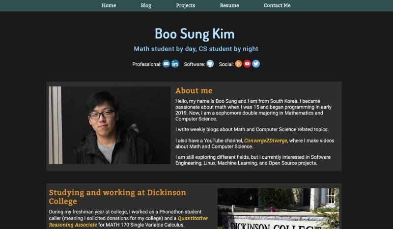
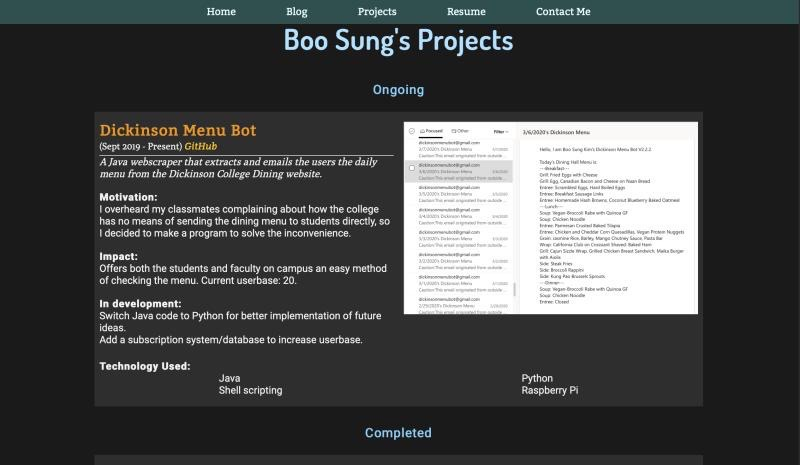
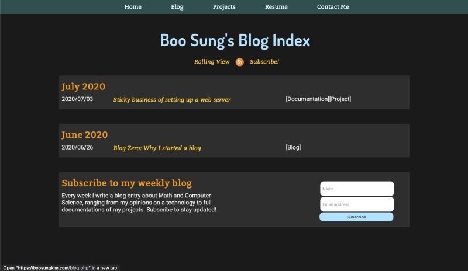
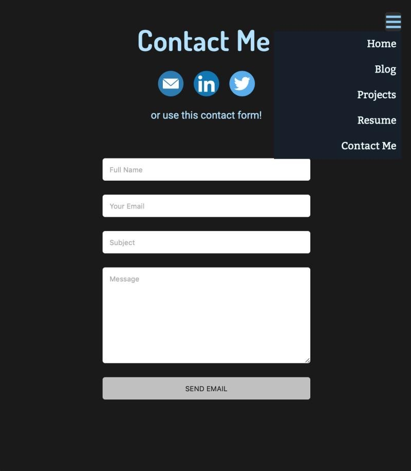
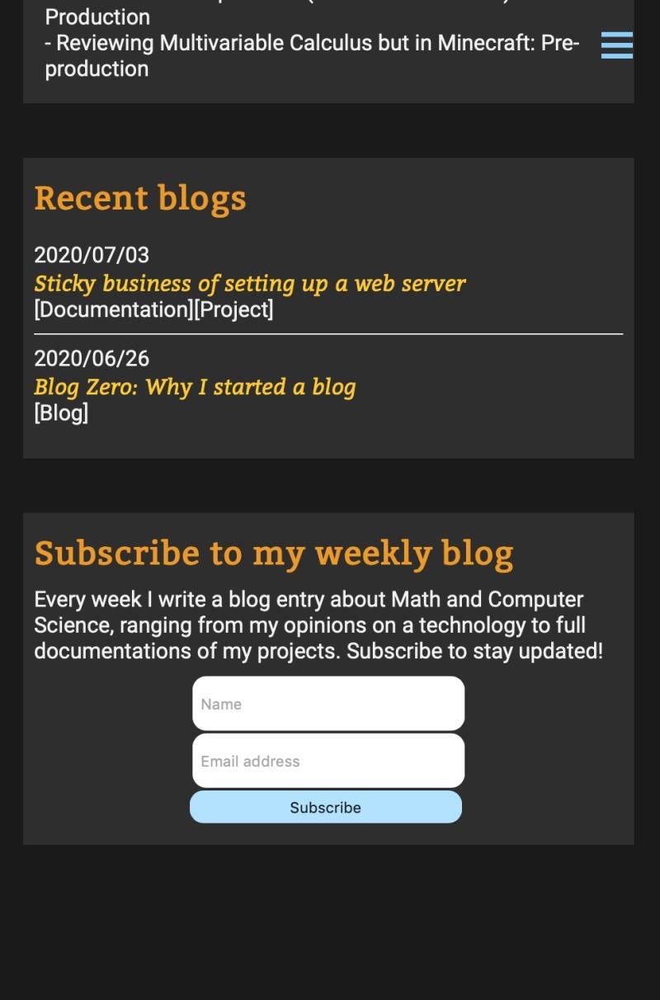
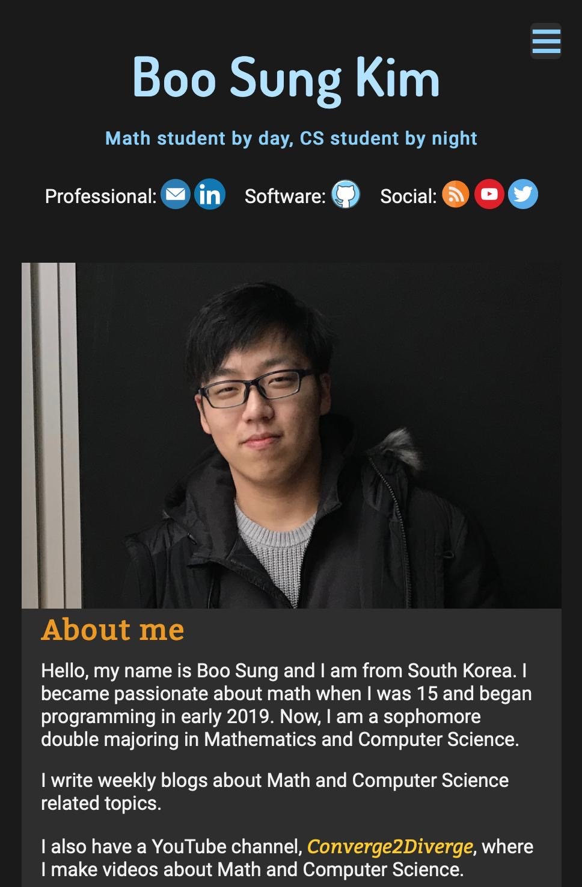

# Old Personal Website <!-- omit in toc -->
My old personal website built from scratch. This has been replaced with a newer version of the site under the same [URL](https://boosungkim.com)

## Index <!-- omit in toc -->
- [About](#about)
- [Demo](#demo)
- [Credits](#credits)
- [License](#license)

## About
This project includes a full chess engine, gui engine, and an AI engine. The AI engine utilizes the minimax and alpha beta pruning algorithms.

## Demo
Here are some demo images.

## Credits
I built most of the website from ground up by myself. I used PHPList for the email newsletter, but I coded most other things.

## License
This project is licensed under the GNU GPLv3 License - see the [LICENSE](./LICENSE) file for details.
